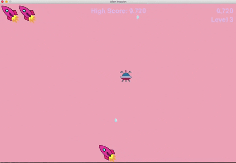

# Alien Invasion

The infamous retro game where user has to fight off waves of invading aliens.

## Motivation

To learn Python 3 while building something fun.

## Screenshot



## Dependencies

- [Python3](https://www.python.org/download/releases/3.0/)

## Installation

Once python 3 is installed please do the following

```bash
pip3 install pygame
```
## Usage

To run the application, please do the following

```bash
python3 alien_invasion.py
```

## Credit
[Python Crash Course](https://ehmatthes.github.io/pcc/) by [Eric Matthes](https://ehmatthes.github.io/about/)
